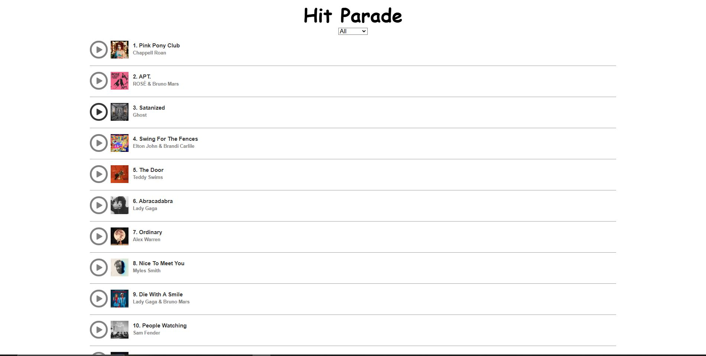

# React Hit Parade

Ecommerce React App, that handles clicks to Add/Delete Items into a Shopping basket. 

# How to start

* Clone this repository
* Install Node.js onto your machine.
* cd into the root folder of the project
* Run ***npm install*** in the terminal to install the packages for the project

# UI

